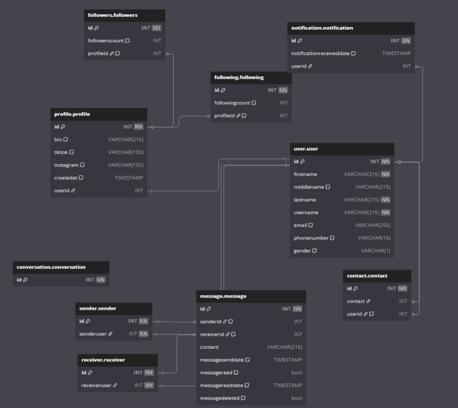

# Tables

```SQL
Project MVP_TELESYNC{
  database_type:"postgresSQL"
  Note:"Database design for TeleSync"
}

Table user.user{
  id INT [PRIMARY KEY, INCREMENT, NOT NULL]
  firstname VARCHAR(215) [NOT NULL]
  middlename VARCHAR(215) [DEFAULT:NULL]
  lastname VARCHAR(215) [NOT NULL]
  username VARCHAR(215) [NOT NULL]
  email VARCHAR(256) [DEFAULT:NULL]
  phonenumber VARCHAR(15) [DEFAULT:NULL]
  gender VARCHAR(1) [DEFAULT:NULL]
}

Table userprofile.userprofile{
  id INT [PRIMARY KEY, INCREMENT, NOT NULL]
  bio VARCHAR(215) [DEFAULT:NULL]
  tiktok VARCHAR(100) [DEFAULT:NULL]
  instagram VARCHAR(100) [DEFAULT: NULL]
  createdat TIMESTAMP [DEFAULT: `now()`]
  userid INT [REF:-user.user.id]
}

Table followers.followers{
  id INT [PRIMARY KEY, INCREMENT, NOT NULL]
  followerscount INT [DEFAULT:0]
  profileid INT [REF:>profile.profile.id, NOTE:"A user profile will display number of user followers. So a user can have 0 or many followers."]
}

Table following.following{
  id INT [PRIMARY KEY, INCREMENT, NOT NULL]
  followingcount INT [default:0]
  profileid INT [REF:>profile.profile.id, NOTE:"A user profile will display number of people user is following. So a user can follow 0 or many other users."]
}

Table notification.notification{
  id INT [PRIMARY KEY, INCREMENT, NOT NULL]
  notificationreceiveddate TIMESTAMP [DEFAULT:`now()`]
  userid INT [REF:>user.user.id]
}

// A contact is a type of user
Table contact.contact{
  id INT [PRIMARY KEY, INCREMENT, NOT NULL]
  contact INT [REF:>user.user.id]
  userid INT [REF:>user.user.id,Note:"User can have 0 or many contacts"]
}

//A SENDER IS A TYPE OF USER -> A sender can be a user
Table sender.sender{
  id INT [PRIMARY KEY, INCREMENT, NOT NULL]
  senderuser INT [REF:-user.user.id, NOT NULL]
}

//A RECEIVER IS A TYPE OF USER
Table receiver.receiver{
  id INT [PRIMARY KEY, INCREMENT, NOT NULL]
  receiveruser INT [REF:-user.user.id, NOT NULL]
}

Table message.message{
  id INT [PRIMARY KEY, INCREMENT, NOT NULL]
  senderid INT [REF:> sender.sender.id,NOTE: "A sender can send 0 or more messages"]
  receiverid INT [REF:> receiver.receiver.id,NOTE: "A receiver can receive one or more messages from a sender"]
  content VARCHAR(215)
  messagesenddate TIMESTAMP [DEFAULT:`now()`]
  messageread bool [default:FALSE]
  messagereaddate TIMESTAMP [default: NULL]
  messagedeleted bool [DEFAULT:FALSE]
}

Table conversation.conversation{
  id INT [PRIMARY KEY, INCREMENT, NOT NULL]
}
```

# Designing MVP

MVP

